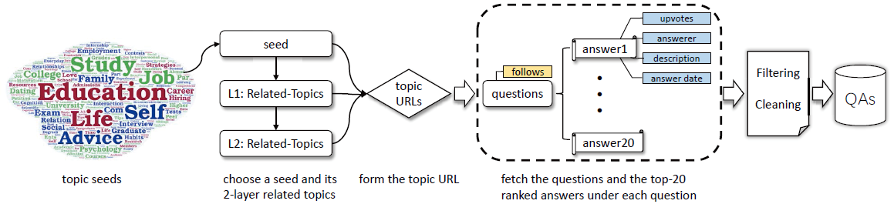
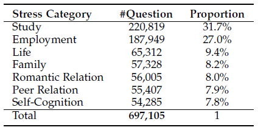
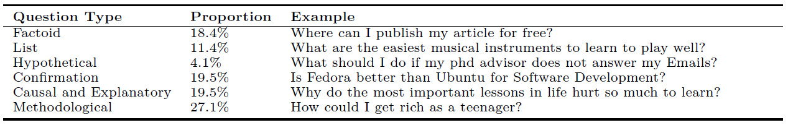
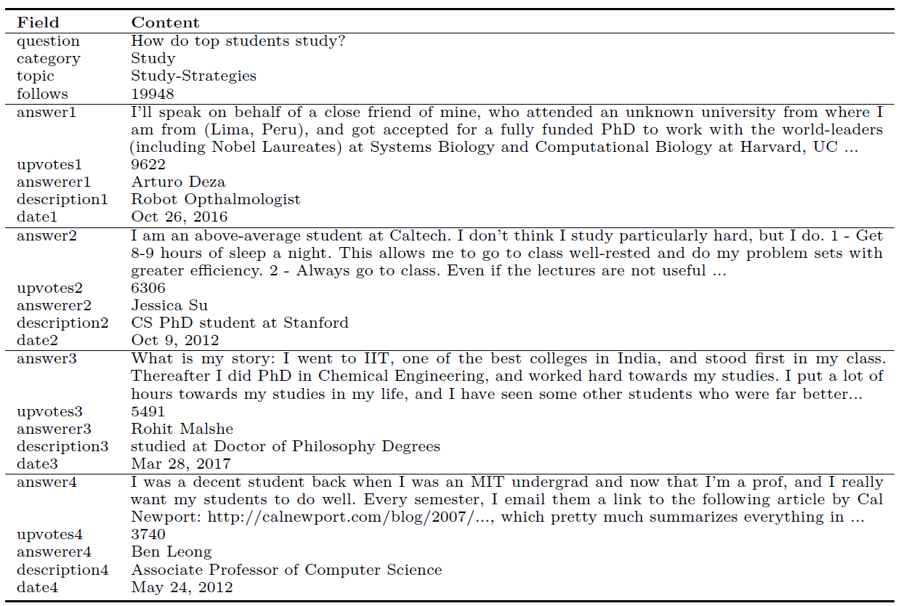
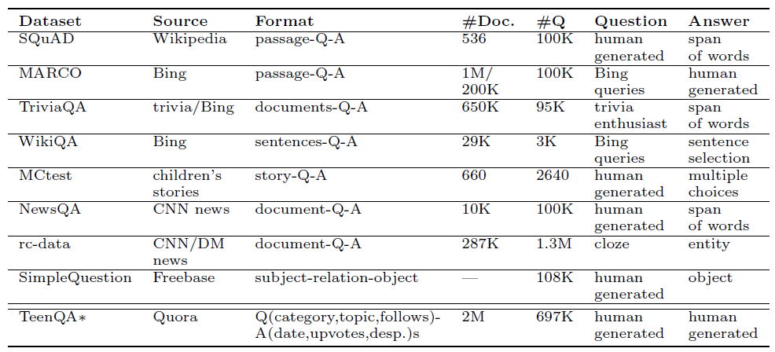

# TeenQA
TeenQA is a large scale topic-specific QAs dataset constructed from Quora, containing ~70K teens' commonly-encountered questions and ~2M community-given answers. TeenQA is intended for non-commercial research purposes only to promote advancement in the fields of E-bibliotherapy and NLP (e.g. question generation, reading comprehension and multi-document summarization).

The dataset is provided "as is" without warranty. Please contact us at xinyx16@mails.tsinghua.edu.cn if you own any of the documents made available but do not want them in this dataset.

See paper: *Generating Instructive Questions from Multiple Articles to Guide Reading in E-Bibliotherapy*

------
### Description

- Contruction process

 
- Topics Distribution

- Question types

- An example

------

### Comparison with other QA dataset

-------

### Download
(ALL data will be made public once the paper is accepted.)

- All data [TeenQA\\_all\\_697105.json](http://drive/teenQA_all.html)
- Training set [TeenQA\\_train\\_694836.json](http://drive/teenQA_train.html)
- Validation set [TeenQA\\_val\\_1269.json](http://drive/teenQA_val.html)
- Testing set [TeenQA\\_test\\_1000.json](http://drive/teenQA_test.html)

-------

### Citation

	@article{TeenQA,
	  author    = {Yunxing Xin and
	               Xiaohao He and
	               Ling Feng},
	  title     = {Generating Instructive Questions from Multiple Articles to Guide Reading in E-Bibliotherapy},
	  journal   = {},
	  year      = {2018}
	}

